<table>
<tr>
<td valign="top"></td>
<td valign="top"></td>
</tr>
</table>

# Léo

**Full-Stack Developer · AI · BTS SIO SLAM**

Je construis des applications, des outils web et des projets utiles avec une attention particulière portée au design, à l'automatisation et à l'expérience utilisateur.

 

 

### Projets en cours

`ToutConvert` · `BasePilot` · `Medicare` · `Discord SkyBlock Bot` · `CrazyGames Projects`

 

Build useful software. Learn continuously. Ship real projects.

